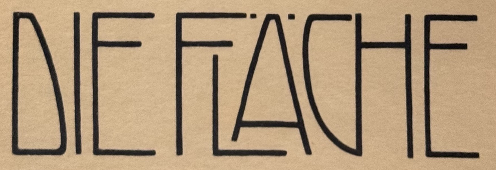

# KAIROS Font – Design-Spezifikation

| | |
|---|---|
| Datum | 2026-10-06 |
| Projekt | HabUndGutFont (`~/Projekte/HabUndGutFont`) |
| Schrift | KAIROS Font (so auch im Schriftmenü) |
| Umfang | Meilenstein 1 im Detail, M2–M5 als Ausblick |
| Status | Entwurf zur Durchsicht |

## 1. Ziel

KAIROS Font ist eine Display-Schrift im Duktus der Wiener Moderne um 1902, dazu ein Werkzeug, das beliebigen Text zu ineinandergreifenden Schriftzügen setzt – so, wie es der Schriftzug „DIE FLÄCHE“ vormacht.

Zwei Ergebnisse aus einer gemeinsamen Quelle:

1. **Web-App (lokal):** Text eingeben, die Engine verschachtelt, unterfährt und verbindet Buchstaben automatisch, bietet Varianten an und lässt jeden Buchstaben von Hand nachjustieren. Export als SVG und PNG.
2. **Font-Datei (ab M2):** OTF für Desktop-Programme, WOFF2 fürs Web, mit einem Grundset automatischer Verschmelzungen.

Zweck: Kunst- und Lernprojekt sowie Werkzeug für die eigene Gestaltung. Privat, kein Verkauf, keine Veröffentlichung geplant.

## 2. Referenz



Quelle: Mappenwerk *Die Fläche*, Bd. I, S. 97 (Verlag Anton Schroll, Wien, um 1902). Gestalter des Blatts unbekannt. Ganzes Blatt: `reference/die-flaeche-foto.jpg`.

Merkmale, die KAIROS übernimmt (am Foto gemessen, „Höhe“ = Versalhöhe):

| # | Merkmal | Wert, Beispiel |
|---|---|---|
| 1 | Monoline: eine Strichstärke, stumpfe Enden | Strich ≈ 1/30 der Höhe |
| 2 | Nur Versalien, schmal und hoch, Breiten stark variabel | I = ein Strich, Ä sehr breit |
| 3 | Obere Balkenlinie | E, F, H: ≈ 22 % unter der Oberkante |
| 4 | Untere Balkenlinie, symmetrisch zur oberen | A: ≈ 22 % über der Grundlinie |
| 5 | Asymmetrische Bögen | D oben schmal, unten bauchig; C spiegelbildlich |
| 6 | Verschachteln | L ≈ 70 % hoch, unter den F-Mittelarm geschoben |
| 7 | Unterfahren | L-Fuß läuft unter dem Ä durch, linkes A-Bein endet frei ≈ 10 % über der Grundlinie |
| 8 | Strich teilen | C-Bogen mündet unten in den linken H-Stamm, oben bleibt ein schmaler Spalt |
| 9 | Umlaut | zwei kleine Quadrate (≈ Strichstärke) auf Höhe der Oberkante, neben der A-Spitze |
| 10 | Wortblock | Ober- und Unterkante bündig, gleichmäßiger Rhythmus der Senkrechten |

## 3. Entscheidungen

| Thema | Entscheidung |
|---|---|
| Stil | „Die Fläche“-Duktus als Basis; weitere Wiener Handschriften (Hoffmann, Moser, Peche …) später als Stil-Varianten |
| Nähe zum Original | genauer Kern, moderne Ergänzungen erlaubt |
| Strich | nur Monoline, Enden stumpf |
| Proportion | schmal und hoch; breite Formen erst als späterer Stil |
| Zeichensatz | Versalien A–Z, ÄÖÜ, ẞ, Ziffern, Grundsatzzeichen und echte Kleinbuchstaben |
| Kleinbuchstaben-Eingabe | ergibt echte Kleinbuchstaben (ab M4). Kleinere Versalien zum Einschreiben und Stapeln erzeugt die Engine selbst |
| Einsatz | Display: Plakat, Titel, Logo, Schild |
| Font-Formate | OTF + WOFF2 |
| Verschmelzung im Font | ja, Grundset über kontextuelle Varianten (OpenType `calt`) |
| Engine-Techniken | M1: a Verschachteln, b Unterfahren, c Strich teilen, d Balkenlinien, e Breite. Später: f Stapeln, g Einschreiben, h Überkreuzen |
| Automatik | automatisch + Varianten zum Durchklicken + Handarbeit je Buchstabe |
| Berührung | je nach Paar: verschmelzen (geteilter Strich) oder ineinandergreifen ohne Berührung |
| Zielform | M1 eine Zeile; M3 Rechteck, mehrzeilig |
| Plattform | lokale Web-App, Desktop-Browser, deutsche Oberfläche, ein Nutzer |
| Export | SVG (Striche) + PNG; keine Kontur-Vereinigung im Export |
| Glyphen | parametrisch im Code konstruiert (Claude), Abnahme per Sichtprüfung (Hagen) |
| Qualität | für die eigene Nutzung, kein Verkaufsniveau |
| Lizenz | privat |
| Namen | Projekt „HabUndGutFont“, Schrift „KAIROS Font“ |
| HAGEN AAD FOCK | M1: Testwort für die Engine + von Hand ausgearbeitete Vorlage. Später: Namens-Ligatur im Font (M2), Monogramm HAF (M2), Name als Block (M3) |
| Werkzeuge | nur freie Werkzeuge, alles lokal, Git lokal (GitHub nur auf Wunsch) |

## 4. Meilensteine

| | Inhalt | Abnahme |
|---|---|---|
| **M1** | 13 Zeichen (A C D E F G H I K L N O Ä), Engine a–e, eine Zeile, Varianten, Handarbeit, Vorlagen, UI, Export SVG/PNG | Abschnitt 10 |
| **M2** | alle Versalien, ÄÖÜ, ẞ, Ziffern, Grundsatzzeichen; Font-Build OTF + WOFF2 mit `calt`-Grundset (FL, LA/LÄ, CH, CK, TH, LT); Namens-Ligatur; Monogramm HAF | „FLÄCHE“ erscheint in InDesign und im Browser verschmolzen |
| **M3** | Zielform Rechteck, mehrzeilig, Umbruch; Name als Block | eigene Spec |
| **M4** | Kleinbuchstaben: Vorbilder recherchieren (Larisch, *Ver Sacrum*), entwerfen | eigene Spec |
| **M5** | Stil-Varianten, eventuell variabler Font | eigene Spec |

Jeder Meilenstein ab M2 bekommt eigene Spec, eigenen Plan und eigene Umsetzung.

## 5. Architektur (M1)

```
Text + Regler + Pins
        │
        ▼
     Engine ── nutzt ──▶ Regeln a–e ── lesen ──▶ Glyphen (Skelett, Andockstellen)
        │
        ▼  Layout (platzierte Buchstaben mit Reglerwerten)
   Renderer (SVG) ──▶ UI (Vorschau, Griffe, Varianten, Speicher, Export)
```

### 5.1 Einheiten

- 1000 Einheiten pro Geviert (UPM), Versalhöhe 700, Grundlinie y = 0, y wächst nach oben.
- Stil „Fläche 1902“, Startwerte:
  - Strich 24
  - obere Balkenlinie y = 546, untere y = 154
  - Mindestabstand (Lichtweite zwischen Strichen verschiedener Buchstaben) ≈ 30
  - Buchstaben- und Wortabstand: am Foto kalibriert

### 5.2 Module

| Datei | Aufgabe | hängt ab von |
|---|---|---|
| `src/geom.ts` | Punkte, Pfade (SVG-Pfaddaten), Abstand zwischen Mittellinien | – |
| `src/style.ts` | Stil-Regler, Stil „Fläche 1902“ | – |
| `src/glyphs.ts` | Glyphen-Definitionen M1 | geom, style |
| `src/rules.ts` | Verbindungen a–e | geom, glyphs |
| `src/engine.ts` | Suche, Bewertung, Pins, Varianten | rules, glyphs |
| `src/render.ts` | Layout → SVG | geom |
| `src/ui.ts` | Seite, Griffe, Overlay, Speicher, Export | engine, render |
| `index.html` | Einstieg | ui |
| `presets/*.json` | mitgelieferte Vorlagen | – |

### 5.3 Glyphen-Modell

Ein Buchstabe ist ein **Skelett**: Mittellinien (Geraden und kubische Bögen), berechnet aus Reglern. Der Strich kommt erst beim Zeichnen dazu, deshalb bleibt die Strichstärke beim Strecken und Kürzen gleich.

```ts
type Params = Record<string, number>;

interface GlyphDef {
  char: string;                                              // "F", "Ä" …
  params: Record<string, { min: number; def: number; max: number }>;
  skeleton(p: Params, s: Style): string[];                   // Mittellinien als SVG-Pfaddaten
  advance(p: Params, s: Style): number;                      // Vorschub inkl. Seitenabstand
  docks(p: Params, s: Style): Dock[];                        // Andockstellen
}

type Dock =
  | { kind: "freeZone"; side: "left" | "right"; box: Box }   // unter F-Armen, über L-Fuß
  | { kind: "foot"; y: number; maxExtend: number }            // verlängerbarer Fuß oder Arm
  | { kind: "terminal"; at: Pt }                              // offenes Bogenende (C, G)
  | { kind: "stem"; side: "left" | "right"; x: number }       // senkrechter Stamm
  | { kind: "bar"; line: "high" | "low" }                    // Querbalken
  | { kind: "leg"; side: "left" | "right"; minEndY: number }; // A-Bein, darf höher enden
```

- Gemeinsame Regler: `width`, `height` (Anteil der Versalhöhe). Je nach Buchstabe zusätzlich `bar` (oben/unten), `footExtend`, `armExtend`, `legEndY`.
- Umlautpunkte: Quadrate (Kantenlänge ≈ Strich) innerhalb der Versalhöhe, damit der Block oben bündig bleibt.
- Formen ohne Vorlage werden in Feedbackrunden entschieden. Startideen:
  - O: schmales Oval mit geraden Flanken
  - G: wie C, mit kurzem Balken auf der unteren Linie
  - K: Arme treffen sich auf der oberen Balkenlinie
  - N: senkrechte Stämme mit Diagonale
- Ein späterer Stil besteht aus einem anderen Satz Stil-Regler plus einzelnen ersetzten Glyphen.

### 5.4 Verbindungsregeln

Jede Regel ist eine Funktion `(links, rechts, stil) → Verbindung | null`. Eine Verbindung enthält die Regleränderungen beider Buchstaben, die horizontale Verschiebung und ihre Kosten.

| Regel | Bedingung | Wirkung | Beispiele |
|---|---|---|---|
| a Verschachteln | links `freeZone` rechts | rechter Buchstabe wird auf Zonenhöhe gekürzt und rückt in die Zone | FL, FO |
| b Unterfahren | links `foot`, rechts `leg` links | Fuß wird bis unter den Nachbarn verlängert, Nachbarbein endet ≥ Mindestabstand darüber | LÄ, LA |
| c Strich teilen | links `terminal`, `stem` rechts oder `leg` rechts; rechts `stem` links oder `leg` links | Bogenende, Stamm oder Beinende fällt genau auf den Nachbarstrich | CH, CK, GE, HE, NE, AA (Füße treffen sich) |
| d Balken verbinden | beide `bar` auf derselben Linie, Lücke ≤ Grundabstand | Balken läuft über die Lücke durch | AA |
| e Breite | Zielbreite gesetzt | Breiten werden innerhalb der Spielräume angepasst, gewichtet nach Spielraum | – |
| keine | immer | Grundabstand | – |

- Ob der Balken eines Buchstabens oben oder unten liegt, gehört zum Zustand des Buchstabens (Teil von d). Regel d selbst verbindet nur.
- Ein Buchstabe darf links und rechts verbunden sein, wenn sich die Regleränderungen nicht widersprechen. Beispiel L: links verschachtelt (`height` kleiner), rechts unterfahren (`footExtend` größer) – verträglich. Widerspruch → Kombination ungültig.
- Über ein Leerzeichen wird nie verbunden.

### 5.5 Suche und Bewertung

- Zustand an jeder Buchstabengrenze ist die gewählte Verbindung. Zum Zustand eines Buchstabens gehört außerdem seine Balkenlinie. Die Regler eines Buchstabens folgen aus linker Verbindung, rechter Verbindung und Pins.
- Die Suche geht als dynamische Programmierung über alle Grenzen und liefert die k besten Pfade (k = 6) als Varianten. Die Laufzeit wächst linear mit der Textlänge, die Vorschau aktualisiert sich beim Tippen.
- Harte Regeln (sonst ungültig):
  - keine ungewollte Berührung: Lichtweite < Mindestabstand ist nur an geteilten Strichen erlaubt
  - Regler bleiben im Spielraum
  - Pins werden eingehalten
- Bewertung (kleiner ist besser). Alle Gewichte stehen an einer Stelle und werden am Referenztest kalibriert:
  - Kosten je Verbindung, skaliert mit dem Regler „Verschränkung“ (brav ↔ wild)
  - Rhythmus: Streuung der Abstände zwischen Senkrechten
  - Bündigkeit: Anteil der Zeilenbreite ohne Strich an Ober- und Unterkante
  - Löcher: freie Flächen über verkürzten Buchstaben ohne Überdachung
  - Breitenabweichung, falls die Zielbreite nicht erreichbar ist
- Gleichstände werden nach fester Reihenfolge aufgelöst: gleiche Eingabe ergibt immer die gleiche Rangliste.

### 5.6 Handarbeit (Pins)

- Pin auf einem Buchstaben: feste Werte für Höhe, Breite, Balkenlinie, Verlängerungen.
- Pin auf einer Grenze: erzwungene Verbindung (auch „keine“).
- Die Engine rechnet mit Pins als harten Vorgaben neu. Ist ein Pin nicht erfüllbar, erscheint ein Hinweis, der Pin bleibt markiert.

### 5.7 Vorlagen

Format (Beispiel):

```json
{
  "name": "DIE FLÄCHE",
  "text": "DIE FLÄCHE",
  "style": "flaeche-1902",
  "controls": { "targetWidth": null, "interlock": 0.5 },
  "variant": 0,
  "pins": { "letters": {}, "joins": {} },
  "overlay": { "src": "reference/die-flaeche-entzerrt.jpg", "x": 0, "y": 0, "scale": 1 }
}
```

- Mitgeliefert:
  - `presets/die-flaeche.json`: mit Overlay, Kalibrierwerte werden beim Bau ermittelt
  - `presets/hagen-aad-fock.json`: von Hand ausgearbeitet
- Eigene Vorlagen liegen im Browser-Speicher und lassen sich als JSON exportieren und importieren.

### 5.8 Renderer

- Layout → `<svg>`: je Buchstabe ein `<g>` mit Verschiebung, je Mittellinie ein `<path>`.
  - Attribute: `fill="none"`, `stroke-width` = Strich, `stroke-linecap="butt"`, `stroke-linejoin="miter"`.
  - Die y-Achse wird per Transform gespiegelt.
- Überlappende Striche gleicher Farbe wirken verschmolzen, eine Konturberechnung ist nicht nötig.
- Platzhalter für nicht entworfene Zeichen: Rechteck-Umriss in Versalhöhe.

## 6. UI

```
┌──────────────────────────────────────────┬─────────────────────┐
│ [ DIE FLÄCHE                ] Vorlagen v │ Zielbreite   frei v │
├──────────────────────────────────────────┤ Verschränkung --o-- │
│                                          │ > Feinheiten        │
│        Vorschau (SVG, live)              │   Strich, Balken    │
│        Klick auf Buchstabe → Griffe      │ [ ] Original drüber │
│                                          │ Farben: Tinte/Papier│
├──────────────────────────────────────────┤                     │
│ Varianten  < 1  2  3  4  5  6 >          │ [SVG]   [PNG 2x v]  │
└──────────────────────────────────────────┴─────────────────────┘
```

- **Eingabe:** In M1 wird Text in Versalien umgewandelt; echte Kleinbuchstaben kommen ab M4.
- **Vorlagen-Menü:** DIE FLÄCHE, HAGEN AAD FOCK, eigene Vorlagen; „Als Vorlage speichern“.
- **Regler:**
  - Zielbreite (frei oder Wert)
  - Verschränkung
  - „Feinheiten“ (aufklappbar): Strich, obere und untere Balkenlinie
- **Varianten:** Leiste 1–6, auch mit Pfeiltasten.
- **Klick auf Buchstabe:**
  - Griffe für Höhe, Breite, Balken (rastet auf den Linien ein) und Fuß- bzw. Armende.
  - Das Menü „Verbindung links/rechts“ zeigt nur die möglichen Regeln.
  - Gepinnte Buchstaben sind markiert und einzeln zurücksetzbar. ⌘Z / ⇧⌘Z.
- **Original drüber:** Foto halbtransparent mit Deckkraft-Regler, nur in der Vorlage DIE FLÄCHE.
- **Farben:** Tinte und Papier über `<input type="color">`, Standard Schwarz auf Papierton.
- **Export:**
  - SVG ohne Griffe und Markierungen, enger Rahmen mit Rand.
  - PNG in 1×, 2× oder 4×, auf Papier oder transparent (über Canvas, ohne Bibliothek).
- **Speicher:** Letzter Stand und eigene Vorlagen liegen in `localStorage`, alle Zugriffe abgefangen. Die App läuft auch ohne Speicher.

## 7. Fehlerfälle

| Fall | Verhalten |
|---|---|
| Zeichen nicht entworfen | Platzhalter + Hinweis „Zeichen X noch nicht entworfen“ |
| Zielbreite unerreichbar | nächstbeste Variante + Hinweis |
| Pin nicht erfüllbar | Hinweis, Pin bleibt markiert, Rest wird gesetzt |
| Vorlage ungültig | wird ignoriert + Hinweis |
| Browser-Speicher gesperrt | App läuft ohne Speichern |

## 8. Technik

- TypeScript ohne Framework, keine Laufzeit-Abhängigkeiten.
- Bun 1.3 übernimmt drei Aufgaben:
  - Dev-Server: `bun ./index.html`
  - Bundler
  - Tests: `bun test`
- Typprüfung bei Bedarf mit `bunx tsc --noEmit`.
- Ab M2 baut ein Python-Skript den Font:
  - Abhängigkeiten im Skript deklariert (PEP 723), Start mit `uv run`
  - Bibliotheken: fontTools, ufoLib2, ufo2ft, skia-pathops (Strich → Kontur, `Path.stroke` am 2026-10-06 geprüft), uharfbuzz für Tests
- Git lokal.

## 9. Ausblick Font-Build (M2)

- **Skelette:** Ein Bun-Skript berechnet sie mit den Startwerten und schreibt sie als JSON.
- **Python-Build:**
  - Strich → Kontur mit skia-pathops, Überlappungen vereinigen
  - UFO → ufo2ft → OTF; WOFF2 über fontTools
- **Verschmelzungen über `calt`:**
  - Jeder Buchstabe bekommt Varianten (z. B. `L.short`, `L.foot`, `L.short.foot`, `A.legL`, `C.join`), dazu Unterschneidung.
  - Es gelten dieselben Regeln wie in der Engine.
  - So kombinieren sich Ketten wie F-L-Ä ohne Dreier-Ligaturen.
- **Name und Monogramm:**
  - Namens-Ligatur: die Folge „HAGEN AAD FOCK“ wird über `liga` durch den ausgearbeiteten Schriftzug ersetzt.
  - Monogramm HAF als eigenes Zeichen; wie man es aufruft, regelt die M2-Spec.
- **Abstände:** werden aus der Geometrie berechnet, wichtige Paare von Hand abgestimmt.
- **Familienname im Font:** „KAIROS Font“.

## 10. Tests und Abnahme M1

Automatisch (`bun test`):

1. **Glyphen:** Jeder Buchstabe bei Minimal-, Start- und Maximalwerten aller Regler → Mittellinien endlich und im Buchstabenfeld (Vorschub × Versalhöhe).
2. **Regeln:** Nach a und b bleibt die Lichtweite ≥ Mindestabstand. Nach c trifft das Strichende den Nachbarstamm auf < 0,5 Einheiten genau.
3. **Kollisionsprüfung:** Konstruierte Fälle mit und ohne Berührung werden richtig erkannt.
4. **Referenztest DIE FLÄCHE:**
   - Die beste Variante zeigt F→L verschachtelt, L→Ä unterfahren, C→H geteilt; alle übrigen Grenzen sind ohne Verbindung.
   - Balken von E, F, H liegen oben, der Balken von Ä unten.
5. **HAGEN AAD FOCK:** Unter den 6 Varianten ist mindestens eine mit F→O verschachtelt und C→K geteilt.
6. **Gleiche Rangliste:** Zweimal dieselbe Eingabe ergibt identische Ranglisten.

Sichtprüfung:

- Claude prüft per Screenshot der laufenden App im Browser-Fenster.
- Abnahme durch Hagen:
  - DIE FLÄCHE wirkt mit eingeblendetem Original „nah am Original“.
  - HAGEN AAD FOCK gefällt als Engine-Ergebnis und als ausgearbeitete Vorlage.

## 11. Nicht in M1

- Kleinbuchstaben (M4), Ziffern und Satzzeichen (M2)
- Font-Datei (M2)
- Rechteck und Mehrzeiligkeit (M3)
- Techniken f Stapeln, g Einschreiben, h Überkreuzen
- Stil-Varianten (M5)
- Kontur-Vereinigung im Export, Plotter- und Laserformate
- Bedienung auf dem Handy, Hosting, GitHub

## 12. Risiken

| Risiko | Umgang |
|---|---|
| G, K, N, O ohne Vorlage | Startideen aus 5.3, Entscheidung in Feedbackrunden |
| Bewertungsgewichte schwer zu treffen | Referenztest DIE FLÄCHE als Anker, alle Gewichte an einer Stelle |
| Foto leicht perspektivisch verzerrt | einmalige Entzerrung über die vier Blattecken (Skript), Ergebnis in `reference/` |
| Engine-Ergebnis korrekt, aber unschön | Varianten, Pins und Regler „Verschränkung“ |
